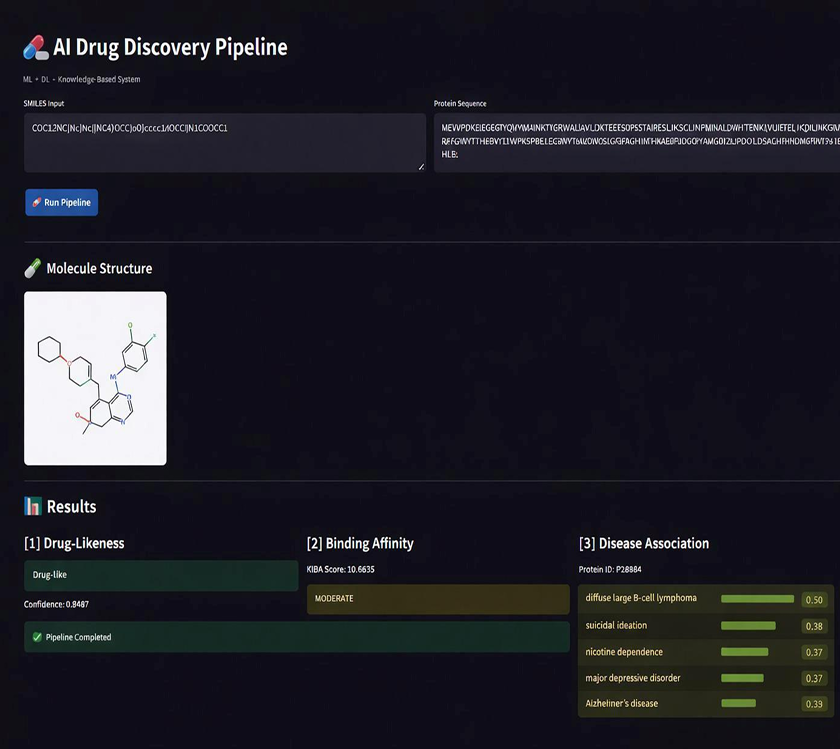

# 🧬 AI-Powered Drug Discovery Pipeline

An end-to-end machine learning pipeline that screens drug candidates in three automated stages — **drug-likeness classification**, **binding affinity prediction**, and **disease association ranking** — wrapped in an interactive Streamlit dashboard.

> 🎓 Final Year B.Tech Project (CSE) — Ahalia School of Engineering & Technology, APJ Abdul Kalam Technological University

---

## 📌 Overview

Drug discovery is slow and expensive largely because most candidate compounds fail early-stage screening. This project automates that first-pass filtering using a **cascading ML pipeline**: a molecule only advances to the next, more expensive stage of analysis if it clears the previous one — cutting down the search space at every step.

Given a **SMILES string** (molecule) and a **protein sequence** (target), the pipeline returns:

1. **Drug-Likeness** — is this molecule structurally viable as a drug?
2. **Binding Affinity** — how strongly would it bind to the target protein?
3. **Disease Association** — which diseases is the target protein linked to?

| | |
|---|---|
| **Team** | Nazna N · Riya Marjum M R · Sanjay S · Thoiba M |
| **Guide** | Dr. S. Gunasekaran, Professor & Head, Dept. of CSE |
| **Institution** | Ahalia School of Engineering & Technology, Palakkad, Kerala |

---

## 🖥️ Demo

<p align="center">
  
</p>

*Input a SMILES string + protein sequence → get molecule rendering, drug-likeness verdict, binding affinity (KIBA score), and top disease associations — all in one run.*

---

## 🏗️ Pipeline Architecture

```
                     ┌────────────────────────┐
   SMILES  ─────────▶│  1. Drug-Likeness       │──── fail ──▶  ❌ Rejected
                      │  (RF / XGBoost)         │
                      └───────────┬─────────────┘
                                  │ pass
                                  ▼
                      ┌────────────────────────┐
Protein Sequence ────▶│  2. Binding Affinity    │
                      │  (GNN + ESM-2 fusion)   │
                      └───────────┬─────────────┘
                                  │
                                  ▼
                      ┌────────────────────────┐
                      │  3. Disease Association │
                      │  (Knowledge-based        │
                      │   lookup + ranking)      │
                      └───────────┬─────────────┘
                                  ▼
                        📊 Ranked disease list +
                        interpretability (SHAP /
                        attention weights)
```

Each stage is decoupled so components (e.g. newer protein language models, expanded disease ontologies) can be swapped independently without breaking the rest of the pipeline.

---

## 📊 Data Analytics & Data Science Skills Demonstrated

This project was built to practice the full data science lifecycle — not just model training:

- **Data collection & integration** from heterogeneous public bio-chemical sources: **PubChem, ChEMBL, DrugBank, BindingDB, DisGeNET, UniProt, Open Targets**
- **Feature engineering** — computing physicochemical molecular descriptors (Lipinski's Rule of Five: molecular weight, LogP, H-bond donors/acceptors, rotatable bonds, polar surface area) with **RDKit**
- **Data cleaning & preprocessing** — invalid SMILES filtering, outlier removal, `StandardScaler` normalization, stratified 80/20 train-test splitting to preserve class balance
- **Exploratory & comparative model evaluation** — benchmarked **7 classical ML algorithms** (Decision Tree, Random Forest, XGBoost, Logistic Regression, Naïve Bayes, k-NN, SVM) with cross-validation and grid-search hyperparameter tuning
- **Deep learning / graph representation learning** — Graph Convolutional Networks for molecular graphs, ESM-2 protein language model embeddings, multi-modal fusion layers (PyTorch Geometric)
- **Statistical evaluation** — accuracy, precision, recall, F1, ROC-AUC, confusion matrices, MSE/MAE/Pearson-r/R² for regression, and information-retrieval ranking metrics (Precision@K, Recall@K, MRR, Hits@K)
- **Model interpretability** — SHAP values, Integrated Gradients, and attention-weight visualization to explain predictions instead of treating models as black boxes
- **Data pipeline design** — caching, feature alignment, and format standardization across three independently-trained models feeding into one integrated workflow
- **Dashboarding / data storytelling** — interactive Streamlit interface for non-technical stakeholders, with live molecule rendering and metric visualization

---

## 📈 Results Snapshot

**Drug-Likeness Classification** (7 models benchmarked, best 2 shown)

| Model | Accuracy | Precision | Recall | F1-Score | AUC-ROC |
|---|---|---|---|---|---|
| **Random Forest** | **92.5%** | 91.8% | 92.2% | 92.0% | **0.96** |
| XGBoost | 91.6% | 90.7% | 91.1% | 90.9% | 0.95 |

**Binding Affinity Prediction** (GNN + ESM-2, regression on pKd)

| Metric | Value |
|---|---|
| MSE | 0.3 |
| Spearman correlation | 0.89 |

**Disease Association Ranking** (Precision@K / Recall@K / MRR)

| Metric | Value |
|---|---|
| Recall@K | 1.00 |
| Hits@K | 1.00 |
| MRR | 0.267 |

*Full methodology, literature review, and evaluation details are available in the accompanying project report (not included in this repo due to file size).*

---

## ⚙️ Tech Stack

| Category | Tools |
|---|---|
| **Language** | Python |
| **ML** | scikit-learn, XGBoost |
| **Deep Learning** | PyTorch, PyTorch Geometric |
| **Cheminformatics** | RDKit |
| **Protein Modeling** | ESM-2 (Evolutionary Scale Modeling) |
| **Interpretability** | SHAP, Captum (Integrated Gradients) |
| **Frontend / Dashboard** | Streamlit |
| **Data Sources** | PubChem, ChEMBL, DrugBank, BindingDB, DisGeNET, UniProt, Open Targets, KIBA/Davis datasets |

---

## 📁 Repository Structure

```
AI-drug-discovery-pipeline/
├── app.py                        # Streamlit dashboard (entry point)
├── pipeline.py                   # Integrated end-to-end pipeline logic
├── binding-affinity/             # GNN + ESM-2 binding affinity model
├── diseasepred/                  # Knowledge-based disease association module
├── druglikenessmodel/            # RF / XGBoost drug-likeness classifiers
├── modules/                      # Shared utility modules
├── protein_disease_cache.json    # Cached protein–disease association lookup
├── protein_sequence_lookup.json  # Sequence → UniProt ID lookup table
├── uniprot_ensembl_mapping.json  # UniProt–Ensembl ID mapping
├── extract_kiba_proteins.py      # KIBA dataset protein extraction script
├── kiba_proteins.csv / kiba.txt  # KIBA benchmark dataset
├── disease_summary.csv           # Disease association summary data
└── test_disease_module.py        # Unit tests for the disease module
```

> ⚠️ **Large datasets and pretrained model weights are not stored in GitHub** due to size limits. Download them [here](https://drive.google.com/drive/folders/1TB-JbOXxUfgPoD97U0MhreIFR7FDb_CM?usp=drive_link) and place them in `binding-affinity/` and `models/` as instructed below.

---

## 🚀 Getting Started

### Prerequisites
- Python 3.9+
- pip

### Installation

```bash
git clone https://github.com/Thoibasaleem/AI-drug-discovery-pipeline.git
cd AI-drug-discovery-pipeline
pip install -r requirements.txt
```

### Download model weights & datasets
Download the required assets from [this Google Drive folder](https://drive.google.com/drive/folders/1TB-JbOXxUfgPoD97U0MhreIFR7FDb_CM?usp=drive_link) and place them into:
1. `binding-affinity/`
2. `models/`

### Run the app

```bash
streamlit run app.py
```

Then open the local URL shown in your terminal, paste in a **SMILES string** and **protein sequence**, and click **Run Pipeline**.

---

## 🧪 Example Input

```
SMILES:  COC12NC(Nc)Nc(NC4)OCC)oO)cccc1/OCC)N1COOCC1
Protein: MEVVPDKEIEGEGGYQIVYVMAINKTYGRWALIAVLDKTEEESQPSSTAIRESLIKSCLINPMINALDWHITENK...
```

**Output:** Drug-likeness verdict + confidence → Binding affinity (KIBA score) → Top-ranked associated diseases with confidence scores.

---

## 🔮 Future Improvements

- Add downloadable/exportable results and run history
- Extend disease association module with real-time API querying (beyond cached lookups)
- Containerize with Docker for reproducible deployment
- Expose pipeline via REST API for integration with tools like KNIME / RDKit pipelines

---

## 📄 License

This project was developed as part of an academic requirement for the B.Tech CSE program at APJ Abdul Kalam Technological University. Feel free to fork and build on it for learning purposes.
